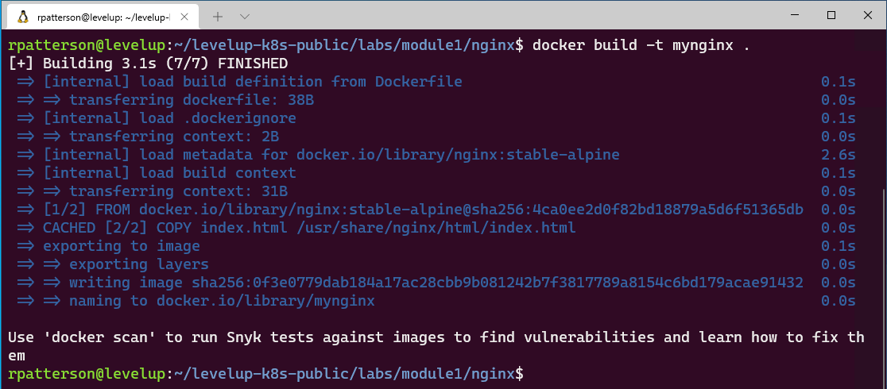

# Module 1 - Introduction to Containers  

> Duration: 60 minutes

## Module 1: Table of Contents  

[Exercise 1: Running Your First Container](#exercise-1-running-your-first-container)  

[Exercise 2: Working with the Docker Command Line Interface (CLI)](#exercise-2-working-with-the-docker-command-line-interface-cli)  

[Exercise 3: Building custom container images using Dockerfiles](#exercise-3-building-custom-container-images-with-dockerfile)  

[Exercise 4: Interaction with a Running Container](#exercise-4-interaction-with-a-running-container)  

[Exercise 5: Tagging](#exercise-5-tagging)  

### Prerequisites 

* WSL 2 Ubuntu 18.04 
* Windows Terminal
* Visual Studio Code 
* Docker Desktop for Windows 

>Use [this](https://docs.microsoft.com/en-us/windows/wsl/tutorials/wsl-containers) tutorial for installation and setup instructions

---

## Exercise 1: Running Your First Container

In this exercise, you will launch a fully functional WordPress blog engine using a Linux-based Docker container. You will learn the commands needed to pull the container image and then launch the container using the Docker CLI. Finally, you will observe that by running the container, you don't need to install any of the WordPress dependencies onto your machine; the WordPress engine binaries and all dependencies will be packaged inside of the container.  


### Running WordPress Blog Engine Container
1. to open a Linux terminal start **Windows Terminal** and choose **Ubuntu 18.04**.


1. Type 
```bash
docker pull tutum/wordpress
```


>**Knowledge**: This will tell Docker client to connect to public Docker Registry and download the latest version of the WordPress container image published by tutum (hence the format tutum/wordpress). The container image has been pre-downloaded for you on the VM to save you a few minutes, but you will see each layer that is cached show the text 'Already exists'.


1. Run the command ```docker images``` and notice "tutum/wordpress" container image is now available locally for you to use.  


1. That's it! You can now run the entire WordPress in a container. To do that run the command  

    ```bash
    docker run -d -p 8888:80 tutum/wordpress
    ```  

> **Note**: Pay close attention to the dash "-" symbol in front of "-p" and "-d" in the command. The "-d" tells Docker to run the container in the background or *detached*. The "-p" tells Docker to map a port from the client machine to the container. In this case, any data received on port 8888 on your laptop will be forwarded to the container on port 80


1. Run the following ```docker ps``` to see the running containers.

```
root@RRP-6A2QIU3:~# docker ps
CONTAINER ID   IMAGE             COMMAND     CREATED          STATUS         PORTS                                             NAMES
96a793005fae   tutum/wordpress   "/run.sh"   10 seconds ago   Up 9 seconds   3306/tcp, 0.0.0.0:8888->80/tcp   jovial_shaw
root@RRP-6A2QIU3:~#
```

1. Open up your browser and Navigate to [http://localhost:8888](http://localhost:8888) and you should see WordPress.


1. Let's launch two more containers based on "**tutum/wordpress**" image. Execute following commands (one line at a time)

    ```bash
    docker run -d -p 8080:80 tutum/wordpress
    
    docker run -d -p 9090:80 tutum/wordpress
    ```


1. Run "**docker ps**" to see all 3 running containers and their port numbers:

```
root@RRP-6A2QIU3:~# docker ps

CONTAINER ID   IMAGE             COMMAND     CREATED          STATUS          PORTS                            NAMES
b6445949e796   tutum/wordpress   "/run.sh"   6 seconds ago    Up 5 seconds    3306/tcp, 0.0.0.0:9090->80/tcp   confident_shockley
2fd55c2251c8   tutum/wordpress   "/run.sh"   53 seconds ago   Up 50 seconds   3306/tcp, 0.0.0.0:8080->80/tcp   great_kapitsa
96a793005fae   tutum/wordpress   "/run.sh"   4 minutes ago    Up 4 minutes    3306/tcp, 0.0.0.0:8888->80/tcp   jovial_shaw
```

1. Now open a new browser window and navigate to URL (using DNS or IP as before) but with port "**8080**" append to it. You can also try port "**9090**". 
    
>Notice that you now have three WordPress blog instances running inside separate containers launched within few seconds. Contrast this to instead creating and running WordPress on virtual machine, which could take significantly more time.


---

## Exercise 2: Working with the Docker Command Line Interface (CLI)

In this exercise, you will learn about common Docker commands needed to work with containers. A comprehensive list of docker commands are available at: [https://docs.docker.com/engine/reference/commandline/docker](https://docs.docker.com/engine/reference/commandline/docker)


### Stopping Single Container

1. First list all the containers currently running by executing "**docker ps**" command. You should see list of all running containers. 

    >Notice, the list contains multiple containers based on WordPress image that you ran in the previous exercise.

    ```
    root@RRP-6A2QIU3:~# docker ps

    CONTAINER ID   IMAGE             COMMAND     CREATED          STATUS          PORTS                            NAMES
    b6445949e796   tutum/wordpress   "/run.sh"   6 seconds ago    Up 5 seconds    3306/tcp, 0.0.0.0:9090->80/tcp   confident_shockley
    2fd55c2251c8   tutum/wordpress   "/run.sh"   53 seconds ago   Up 50 seconds   3306/tcp, 0.0.0.0:8080->80/tcp   great_kapitsa
    96a793005fae   tutum/wordpress   "/run.sh"   4 minutes ago    Up 4 minutes    3306/tcp, 0.0.0.0:8888->80/tcp   jovial_shaw
    ```

1. You can stop a running container by using "**docker stop <CONTAINER_ID> or <NAME>**" command. Where CONTAINER_ID and NAME uniquely identify each container listed by the ```docker ps``` command. Your **CONTAINER ID**s will be different
    
    >Note:You can just use the first couple characters to identity the container ID, such as "**b64**" for the screenshot below.

    ```docker stop b64```
    >REPLACE 'b64' with one of your container id's

1. Now run the "**docker ps**" command and notice the listing show one less container running.

    ```
    root@RRP-6A2QIU3:~# docker ps

    CONTAINER ID   IMAGE             COMMAND     CREATED          STATUS          PORTS                            NAMES
    2fd55c2251c8   tutum/wordpress   "/run.sh"   53 seconds ago   Up 50 seconds   3306/tcp, 0.0.0.0:8080->80/tcp   great_kapitsa
    96a793005fae   tutum/wordpress   "/run.sh"   4 minutes ago    Up 4 minutes    3306/tcp, 0.0.0.0:8888->80/tcp   jovial_shaw
    ```


1. If you want see the Container ID of the stopped container, and you forgot the Container ID, you can run "**docker ps -a"** to see all containers, even those that are stopped/exited.

    


### Restart a Container

1. In previous task you issued a Docker command to stop a running container. You can also issue command to start the container which was stopped. All you need is a container ID (same container ID you used earlier to stop a container in previous section), you can also get this using 'docker ps -a'.

1. To start a container run "**docker start <CONTAINER_ID>**". 

    >This uses the container identifier you use in previous section to stop the container.

    

1. To make sure that container has started successfully run "**docker ps**" command. 
    >Notice that WordPress container is now started.

    


### Removing a Container

1. Stopping a container does not remove it and that's the reason why you were able to start it again in the previous task.

    To delete/remove a container and free the resources you need to issue a different command. Please note that this command does not remove the underlying image but rather the specific container that was based on the image. To remove the image and reclaim its resources, like disk space, you'll will need to issue a different command which is covered under the later section "Removing Container Image".

1. Remove a container
    
    ```powershell 
    docker rm -f <CONTAINER_ID>
    ```

    This uses the container identifier you used in previous section. If you don't have it handy, simply run "docker ps" and copy the container ID from the listing.

    

    >The "**-f**" switch is used to force the remove operation. It's needed if you are trying to remove a container that is running.


### Stopping All Containers

1. At times you may want to stop all of the running containers and avoid issuing command to stop one container at a time.

    ```powershell
    docker stop $(docker ps -aq)
    ``` 
    
    this command will stop all running containers. Basically, you are issuing two commands: First the **docker ps** with relevant switches to capture the list of container IDs and then passing the list of IDs to the **docker stop** command.

    
    


### Removing WordPress Container Image

1. Removing a container image form a local system will let you reclaim its disk space. Please note that this operation is irreversible so proceed with caution. In this task you will remove the WordPress container image as you will not be using it any more. You must stop all containers using the image before you can delete the image, unless you use the force parameter.

1. To remove a container image, you'll need its IMAGE ID. Run command "**docker images**". 
    
    

1. Run the command "**docker rmi <IMAGE_ID> -f**". 

    >Notice the command to remove docker container is "**docker rm**" and to remove an image is "**docker rmi**", with an 'i' for the image. Don't confuse these two commands! The **-f** is to force the removal, you cannot remove an image associated with a stopped container unless you use the force parameter.

    

1. Now, run the command "**docker images**". 

    >Notice that "tutum/wordpress" image is no longer available.

    

---

## Exercise 3: Building Custom Container Images with Dockerfile


A Dockerfile is essentially a plain text file with Docker commands in it that are used to create a new image. You can think of it as a configuration file with a set of instructions needed to assemble a new image. In this exercise, you will learn the common commands that go into Dockerfiles by creating custom images based on common technologies like NGINX and ASP .NET Core.  

### Setup 
First, after the [Prerequisites](#Prerequisites) have been installed, start the Ubuntu Linux distribution using Windows Terminal


Next, download the lab files from GitHub
```bash
git clone https://github.com/RandyPatterson/levelup-k8s-public.git
```

Navigate to the the newly created *labs* directory 

```bash
 cd levelup-k8s-public/labs/; ls
 ```

```bash
rpatterson@levelup:~$ git clone https://github.com/RandyPatterson/levelup-k8s-public.git
    Cloning into 'levelup-k8s-public'...
    remote: Enumerating objects: 259, done.
    remote: Counting objects: 100% (259/259), done.
    remote: Compressing objects: 100% (239/239), done.
    remote: Total 259 (delta 12), reused 259 (delta 12), pack-reused 0
    Receiving objects: 100% (259/259), 29.89 MiB | 31.75 MiB/s, done.
    Resolving deltas: 100% (12/12), done.
rpatterson@levelup:~$ cd levelup-k8s-public/
rpatterson@levelup:~/levelup-k8s-public$ ls
    README.md  labs
```


### Building and Running NGINX Container

1. In this task you will create a new image using the NGINX web server base image hosting a simple static html page. You will start with a Dockerfile with instructions to define its base image, then copy the static html file inside the image and then specify the startup command for the image (using CMD instruction). Later, you will learn how to build the image using Dockerfile and finally will run and test it out.

    The relevant files including static html file **index.html** along with the Dockerfile are available inside the directory **labs/module1/nginx**.  

    ```bash
    cd labs/module1/nginx
    ```
1. Type ```ls``` and press Enter. Notice the available files include "**index.html**" and "**Dockerfile**".

    ```
    rpatterson@levelup:~/levelup-k8s-public$ cd labs/module1/nginx
    rpatterson@levelup:~/levelup-k8s-public/labs/module1/nginx$ ls

    Dockerfile  index.html
    ```

1. Let's examine the Dockerfile by typing the command ```code Dockerfile``` and press Enter. This will launch VS Code

    >You can use any other text editor however, instructions are provided for Visual Studio Code text editor). 

      

1. Move your cursor using the arrow keys to the line starting with **Label author="sampleauthor@contoso.com"** and change the text from that to the following: **LABEL author="YourEmail@Email.com"**. Once you are finished making changes press **CTRL + S** to save your changed.  You can exit VS Code

1. You are now ready to build a new container image based on the Dockerfile you just modified.  
Run the command 
    ```bash
    docker build -t mynginx .
    ```
    You output sould look something like this

      

    >Notice how the build command is reading instructions from the Docker file starting from the top and executing them one at a time. The image will download much faster as this is a very small image.

1. If you want to see the layers of an image, you can do ```docker history mynginx``` and see the one you just built. You can also try running this command on other images you have on your VM too.

    

1. Run the command ```docker images```

    >Notice the new container image appears with the name **mynginx**. Also notice the presence of parent image **nginx** that was pulled from Docker Hub during the build operation. Take a look at the sizes of different images also. This will become important when you build your own custom images to reduce the size for both security and performance.  

    
1. Finally, create and run a new container based on "**mynginx**" image. Run command 
    ```bash 
    docker run -d --name mynginx -p 8080:80 mynginx
    ```

    

1. To test the node app, go to your browser and navigate to  [localhost:8080](http://localhost:8080)

    


## Building and Running ASP.NET Core 3.x Application Inside A Container

In this task you will build ASP .NET Core 3.x application and then package and run it as a container. Change to the relevant directory **labs/module1/aspnetcore**. First, we need to run **dotnet build**, and **publish** to generate the binaries for our application. This can be done manually or by leveraging a **Dockerfile**. In this example, we will run the commands manually to produce the artifacts in a folder called **published**. The **Dockerfile** will only contain instructions to copy the files from the **published** folder into the image.  
     
### Install .NET Core 3.1
If Needed, install .NET Core 3.1 on your Ubuntu 18.04 linux shell using the following commands 

In your Linux terminal run the following commands 
```bash
wget https://packages.microsoft.com/config/ubuntu/18.04/packages-microsoft-prod.deb -O packages-microsoft-prod.deb
sudo dpkg -i packages-microsoft-prod.deb
```

Install dotnet core SDK

```bash
sudo apt-get update; \
  sudo apt-get install -y apt-transport-https && \
  sudo apt-get update && \
  sudo apt-get install -y dotnet-sdk-3.1
```
Verify Installation successful buy running 
```bash
dotnet --version
```

output should be similiar to the following
```
rpatterson@levelup:~$  dotnet --version
3.1.410
```

### Create ASP.NET Core Image
Now that .NET Core 3.1 SKD is installed we can create the image & cotnainer.

Change to the correct directory and start the build process
```bash
cd ../aspnetcore
dotnet build
```
    
   

```dotnet publish -o published```
    


1. Now that the application is ready, you will create your container image. The Dockerfile is provided to you. View the content of Dockerfile by running the following command
    ```
    code Dockerfile
    ```
     

1. To create the container image run the command   
    ```
    docker build -t myaspcoreapp:3.1 .
    ```

    >Notice the **3.1** tag representing the dotnet core framework version.  
        
    

1. Launch the container running your application using the command  
    ```docker run -d --name myaspcoreapp -p 8090:80 myaspcoreapp:3.1  ```

    

    >You are now running ASP.NET Core application inside the container listening at port 80 which is mapped to port 8090 on the host.

1. To test the application, open your browser and navigate to [localhost:8090](http://localhost:8090).  

    

    Notice that the container ID listed on the web page is identical to the container ID assigned by Docker

--- 

## Exercise 4: Interaction with a Running Container

In the previous exercise, you were able to build and run containers based on Dockerfiles. However, there may be situations that warrant interacting with a running container for the purposes of troubleshooting, monitoring etc. You may also want to make changes/updates to a running container and then build a new image based on those changes. In this exercise, you will interact with a running container and then learn to persist your changes as a new image.  

### Interaction with a Running Container

1. On the command line run ```docker ps -a ``` to list all the currently running containers on your virtual machine.

    ```bash 
    docker ps -a 
    ```

    

    >Notice that multiple containers are running. To establish interactive session a with a running container you will need its **CONTAINER ID** or **NAME**. Let's establish an interactive session to a container based on "**mynginx**" image. Please note that your **CONTAINER ID**  will be different. And, unless you specified a name using the **--name** parameter, Docker generated a random name  

1. Run a command 
    ```
    docker exec -it mynginx sh
    ```
    to connect to your **NGINX container**. 

    >You can run the command **docker exec -it &lt;CONTAINER_ID_OR_NAME&gt; bash** using either the container ID or name. 

    >Did You Know? **docker exec** is used to run a command in a running container. The **it** parameter will invoke an interactive shell inside the container. 
    
    >Notice that a new interactive session is now establish to a running container. Since "**sh**" is the program that was asked to be executed you now have access to full bash shell inside the container.

    

    While connected to the container display the contents of the NGINX default page. 

    ```bash
    cat  /usr/share/nginx/html/index.html
    ```
    

    >For more information regarding running commands inside docker container please visit: [https://docs.docker.com/engine/reference/commandline/exec](https://docs.docker.com/engine/reference/commandline/exec)


1. Making Changes to a Running Container

    While you are interacting and running commands inside a running container, you may also want to make changes/updates to it. Later, you may also create a brand-new image out of these changes. In this task you will make changes to **NGINX** container image, test them out and finally create a new image (without the need of Dockerfile). 

    >Please note that this approach of creating container images is generally used to quickly test various changes, but the best practice to create container images is to use a Dockerfile since it is a declarative file that can be kept in source control repositories.


    First, replace the **"Hello NGINX!!!"** string with **"Container Updated"** using the built-in *vi* editor 

    ```bash
    vi /usr/share/nginx/html/index.html
    ```
    Navigate the the string then press **I** to enter *Insert Mode* then replace the text. Once updated exit **vi** by pressing the **ESC** key then typing ```:wq```

    

    type ```exit``` to exit the NGINX container and return back to your PC. 

    Next, verify the changes by navigating to [localhost:8080](http://localhost:8080)

    

1. Interaction with a Running Container

    In the previous task you have made changes to running container. However, these changes are only available to that container and if you were to remove the container, these changes would be lost. One way to address this is by creating a new container image based on running container that has the changes. This way changes will be available as part of a new container image. This is helpful during dev/test phases, where rapid development and testing requires a quick turn-around time. However, this approach is generally not recommended, as it's hard to manage and scale at the production level. Also, if content is the only piece that needs to be changed and shared, then using **volumes** may be another viable option. Volumes are covered in module three.   

    Stop the NGINX container
    ```bash
    docker stop mynginx
    ```
    To create new image run the command 
    ```bash
    docker commit mynginx mynginxv2
    docker images
    ```

    


### Test the new image run a command  
    ```bash
    docker run -d -p 8081:80 mynginxv2
    ```

    >This will create a new container based on the image "**mynginxv2**".

    Finally, to test the container, navigate to [localhost:8081](http://localhost:8081) in browser. 

    

---
## Exercise 5: Tagging

In this exercise you will learn the role of tagging in container and how to tag new and existing container images using Docker commands.

### Tagging Existing Container Image

- In this task you will tag the **mynginx** container image with **v1**. Recall from the last task that currently this image has the **latest** tag associated with it. You can simply run **docker images** to verify that. When working with container images it becomes important to provide consistent versioning information.  
 
- Tagging provides you with the ability to tag container images properly at the time of building a new image using the **docker build -t imagename:tag .** command. You can then refer to the image (for example inside Dockerfile with **FROM** statement) using a format **image-name:tag**.
 
- If you don't provide a tag, Docker assumes that you meant **latest** and use it as a default tag for the image. It is not good practice to make images without tagging them. You'd think you could assume latest = most recent image version always? Wrong. Latest is just the tag which is applied to an image by default which does not have a tag. If you push a new image with a tag which is neither empty nor 'latest', :latest will not be affected or created. Latest is also easily overwritten by default if you forget to tag something again in the future. **Careful\!\!\!**
 
- When you run **docker images** notice the **TAG** column and pay attention to the fact that all of the custom images created in the lab so far have tag value of **latest**. 

        

- To understand the importance of tagging take a look at the container image created in the previous section **mynginx**. The **v2** at the very end was appended to provide an indicator that this is the second version of the image **mynginx**. The challenge with this scheme is that there is no inherent connection between the **mynginx** and **mynginxv2**. With tagging, the same container image will take the format **mynginx:v2**. This way you are telling everyone that **v2** is different but has relation to the **mynginx** container image.  

- Please note that tags are just strings. So, any string including **v1**, **1.0**, **1.1**, **1.0-beta**, and **banana** all qualify as a valid tag.  
 
- You should always want to follow consistent nomenclature when using tagging to reflect versioning. This is critical because when you start developing and deploying containers into production, you may want to roll back to previous versions in a consistent manner. Not having a well-defined scheme for tagging will make it very difficult particularly when it comes to troubleshooting containers.  
 
>A good example of various tagging scheme chosen by Microsoft with dotnet core framework is available at: [https://hub.docker.com/r/microsoft/dotnet/tags](https://hub.docker.com/r/microsoft/dotnet/tags)

1. To tag an existing docker image, run the command 
    ```bash
    docker tag mynginx:latest mynginx:v1
    docker images
    ```

    
    
    >Notice how **latest** and **v1** both exist. **V1** is technically newer, and **latest** just signifies the image that did not have a version/tag before and can feel misleading. Also, note the Image ID for both are identical. The image and its content / layers are all cached on your machine. The Image ID is content addressable, so the full content of it is hashed through a hashing algorithm and it spits out an ID. If the content of any two (or more) images are the same, then the Image ID will be the same, and only one copy of the actual layers are on your machine and pointed to by many different image names/tags.


## Congratulations
 you have successfully completed this module