# Module 2 - Getting Started with Windows Containers

> Duration: 45 minutes     

## Module 2: Table of Contents

[Exercise 1: Working with Nano Server & Windows Server Core Containers](#exercise-1-working-with-nano-server--windows-server-core-containers)

[Exercise 2: Building and Running an IIS Server Windows Container Image](#exercise-2-building-and-running-an-iis-server-windows-container-image)

[Exercise 3: Building an ASP.NET Core Application](#exercise-3-building-an-aspnet-core-application)  

### Prerequisites

* WSL 2 Ubuntu 18.04 
* Windows Terminal
* Visual Studio Code 
* Docker Desktop for Windows 
* Install [Git](https://git-scm.com/download/win)

> Use [this](https://docs.microsoft.com/en-us/windows/wsl/tutorials/wsl-containers) tutorial for installation and setup instructions

## Setup

First, after the [Prerequisites](#Prerequisites) have been installed, start PowerShell using the Windows Terminal

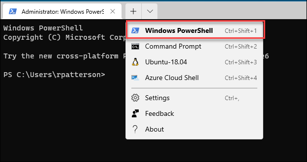

### Next, download the lab files from GitHub

```ps
git clone https://github.com/RandyPatterson/levelup-k8s-public.git
```

Navigate to the the newly created *labs* directory 

```ps
 cd levelup-k8s-public/labs/; dir
```

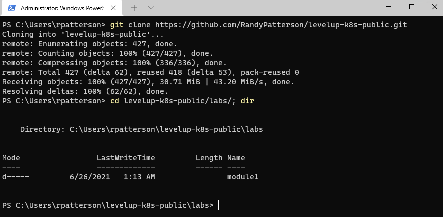

### Finally, verify Docker is running for Windows Containers

Enable Hyper-V and Containers

> May require a reboot

```ps
Enable-WindowsOptionalFeature -Online -FeatureName $("Microsoft-Hyper-V", "Containers") -All
```

Right click on the Docker icon in the taskbar and swith to Windows Contianers if available. If it says "Switch to Linux Containers" then Docker is already setup for Windows Cotnainers.

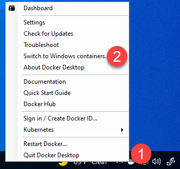

## Exercise 1: Working with Nano Server & Windows Server Core containers

In this exercise, you will learn about the Windows Nano Server and Server Core images. Please read below for an overview of each image. Then you will complete the steps to build and run these containers.

### Windows Server Core Overview

Microsoft starting with Windows Server 2016 has an option of Server Core installation. The Server Core option reduces the amount of space required on disk, the potential attack surface, and especially the servicing requirements. It is recommended that you choose the Server Core installation unless you have a need for the additional user interface elements and graphical management tools that are included in the Server with Desktop Experience option. For an even more lightweight option, see the next section on Nano Server. Server Core allows you to install various Server roles that may not be available in Nano Server including those listed below:

- Active Directory Certificate Services
- Active Directory Domain Services
- DHCP Server
- DNS Server
- File Services (including File Server Resource Manager)
- Active Directory Lightweight Directory Services (AD LDS)
- Hyper-V
- Print and Document Services
- Streaming Media Services
- Web Server (including a subset of ASP.NET)
- Windows Server Update Server
- Active Directory Rights Management Server
- Routing and Remote Access Server and the following sub-roles:
- Remote Desktop Services Connection Broker
- Licensing
- Virtualization
- Volume Activation Services

For a comprehensive list of features available in Server Core, visit [https://technet.microsoft.com/en-us/windows-server-docs/get-started/getting-started-with-server-core](https://technet.microsoft.com/en-us/windows-server-docs/get-started/getting-started-with-server-core).

### Windows Nano Server Overview

Nano Server is optimized as a lightweight operating system for running "cloud-native" applications based on containers and micro-services. There are important differences in Nano Server versus Server Core. As of Windows Server 2016, version 1803, Nano Server is available only as a container base OS image. You must run it as a container in a container host, such as a Server Core installation of Windows Server. Running a container based on Nano Server in this release differs from releases prior to 1803 in the ways listed below:

- Nano Server has been optimized for .NET Core applications
- Nano Server size has been optimized in Windows Server 2019 version
- PowerShell Core, .NET Core, and WMI are no longer included by default as they were in Windows Server 2016, but you can include PowerShell Core and .NET Core container packages when building your container
- There is no longer a servicing stack included in Nano Server. Microsoft publishes an updated Nano image to Docker Hub that you redeploy
- You troubleshoot the new Nano Container by using Docker
- You can now run Nano containers on IoT Core

For a comprehensive list of capability differences between Nano Server and Server Core, visit [https://docs.microsoft.com/en-us/windows-server/get-started/getting-started-with-nano-server](https://docs.microsoft.com/en-us/windows-server/get-started/getting-started-with-nano-server))

Since Windows Server 2016, Microsoft offers both Nano Server and Server Core in the form of Docker images through Docker Hub. With the GA of Windows Server 2019, Microsoft also announced that its base images will now be hosted in the Microsoft Container Registery or MCR. For information on this change, visit [https://azure.microsoft.com/en-us/blog/microsoft-syndicates-container-catalog/](https://azure.microsoft.com/en-us/blog/microsoft-syndicates-container-catalog/). These images will still be discoverable via Docker Hub.  The nature of application you are building typically dictates your selection of base image. For example, the SQL Server 2016 Express image will need Server Core as its base image, but a simple windows service may able to run just fine on Nano server. In the following exercise, you will run a  basic "hello world" container leveraging both the Nano and Server Core images. 

### Run a container based on the Windows Server Core and Nano Server images

You will need to run the commands in this section using the PowerShell console as an administrator. Launch PowerShell using the Windows Terminal


Navigate to the **module2** directory

```ps
cd module2
```

1. The PowerShell console is now available to you. Make sure you are inside of the **module2** labs directory. 
   
    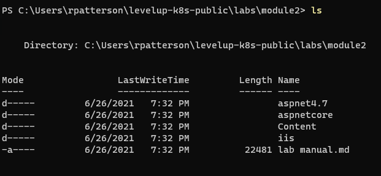

2. First, let's get the list of all the container images available on this Docker host by running the command 
   
   ```powershell
   docker images
   ```
   
   if this is a new installation of Docker your list is probably empty.  Lets grab the images that we will need for this Lab
   
   ```powershell
   docker pull mcr.microsoft.com/windows/servercore:2004
   docker pull mcr.microsoft.com/windows/nanoserver:2004
   ```
   
   - [Docker Hub](https://hub.docker.com/_/microsoft-windows-servercore)
   - [Nano Server](https://hub.docker.com/_/microsoft-windows-nanoserver)
   
   Notice that you already have **windows/servercore** and **windows/nanoserver** images available to you representing **Server Core** and **Nano Server** images.   
   
   > Knowledge: It's important to understand that you can always download specific version of **windows/servercore** and **windows/nanoserver** images by using an appropriate tag. For example, `docker pull mcr.microsoft.com/windows/servercore:10.0.17763.437` will pull the server core image that has a version number 10.0.17763.437. Notice the [mcr.microsoft.com](https://azure.microsoft.com/en-us/blog/microsoft-syndicates-container-catalog/) registry that is the container registry hosted on Microsoft servers, even though the images are discoverable on Docker Hub. All the concepts you learned about docker (Linux) containers and images generally apply as-is to windows containers too. The main deference is the fact that windows containers require the windows operating system as a host, while the Linux containers require Linux operating system.  
   
    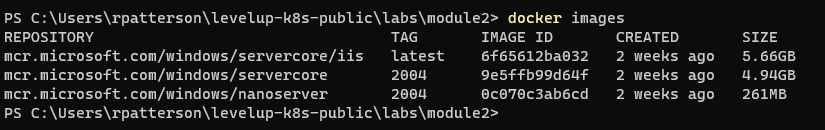

3. You will now run a container based on **Server Core** image (**mcr.microsoft.com/windows/servercore**). Before you do that, run the command `hostname`. This will reveal the hostname of your laptop. 
   
   > Please note that your host machine name will be different.
   
    ```dos
    PS C:\Users\rpatterson\levelup-k8s-public\labs\module2> hostname
    levelup
    ```

4. Run the command 

    ```poweshell 
    docker run -it mcr.microsoft.com/windows/servercore:2004 powershell
    ```

    Please be patient as it will take a minute or so for contianer to start. The **-it** switch provides you with an interactive session. The **PowerShell** is a parameter passed as an argument tells docker to launch PowerShell as your shell running inside the container. 
   
    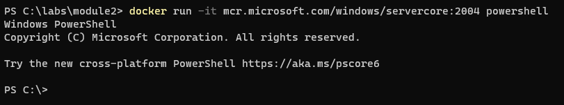

5. Run the command `hostname`. This time you are running it inside the running container. Notice that the host name is different from the host name you get in step 5. The host name you see inside the container is the host name of the container itself. It is based on the container ID. You may want to run other commands as you wish or checkout the filesystem that is independent from the host's filesystem.
   
    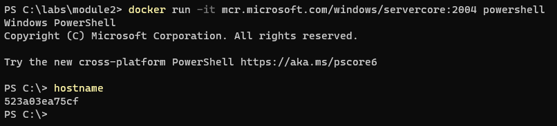

6. Finally, exit the interactive session by typing `exit` and pressing **Enter**. This will take you back to the PowerShell console on the host.  
   

7. Now let's run another container based on **Nano Server** image ( **mcr.microsoft.com/windows/nanoserver**). To do that run the command 

    ```powershell
    docker run -it mcr.microsoft.com/windows/nanoserver:2004 CMD
    ``` 
   
   > The container might take a few seconds to start. This time we are starting a Windows Command prompt instead of Powershell inside of the container)  
   
   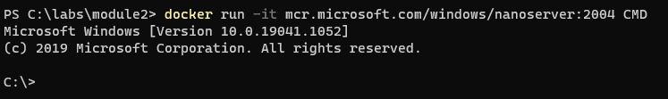  

8. Run the command ```hostname```. Notice that the host name is different from host name you get in the previous steps. Again, the host name you see inside the container is the host name of the container itself, which is based on the container id. You can run other commands as you wish.  
   
   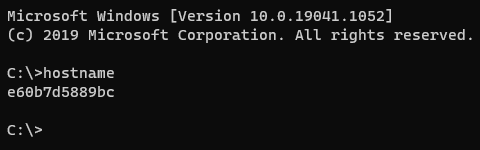

9. Finally, exit the interactive session by typing `exit` and pressing **Enter**. This will take you back to the PowerShell console on the host.  

### Summary

In this exercise, you have created and run containers based on the Windows Server Core & Nano Server container images that Microsoft provides and maintains. You have successfully completed this exercise.

---

## Exercise 2: Building and Running an IIS Server Windows Container Image

In the exercise you will learn how to install IIS Web Server (Web Server Role) on a Windows Server Core base core image. IIS Server is a popular Web Server released by Microsoft. Considering the strong footprint of IIS within enterprises, Microsoft supports IIS on Windows Server Core.

### Build and run an IIS Server Image

1. Make sure you have a PowerShell Console open as an administrator (if you have followed previous task you should already be running a Console). Also, change the current directory to "**iis**" by running the command 

    ```poweshell
    cd labs\module2\iis\
    ```
   
1. The iis folder contains the Dockerfile with instructions to install IIS Server (Web Server Role) on the Windows Server Core base image. Display the Dockerfile using VS Code by running the command 

    ```
    code Dockerfile
    ```
   
    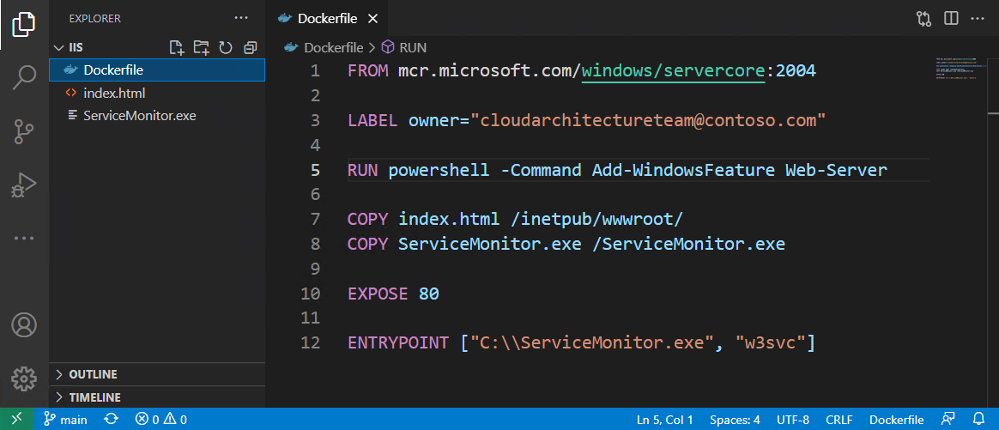
   
   - The **FROM** instruction points to the **mcr.microsoft.com/windows/servercore** to be used as a base image for the new container image
   - The **RUN** instruction executes PowerShell to install Windows Feature "Web Server" (IIS Server)
   - The next 2 commands **COPY** the *index.html* and  *ServiceMonitor.exe* files to the container image. The **ServiceMonitor.exe** is a utility that monitors **w3svc** service inside the container, if the service fails, the exe fails, so Docker knows the container is unhealthy. The **ServiceMonitor.exe** is developed and released by Microsoft (<https://github.com/microsoft/iis-docker/tree/master/windowsservercore-ltsc2019)>. The *index.html* files replace the default IIS page displayed by your browser. 
   - The **EXPOSE** instruction does not actually publish the port. It functions as a type of documentation between the person who builds the image and the person who runs the container, about which ports are intended to be published.    
   - The **ENTRYPOINT** instruction makes sure that monitoring of **w3svc** begins immediately as soon as container starts running. This is what will keep the container in running state. 

   close VS Code

1. To build the new image with IIS installed on it, run the command 

    ```powershell
    docker build -t myiis:v1 .
    ```
    This command builds a new container image with name **myiis** and tag **v1**. The tag conveniently tells everyone information pertaining to the version of the image. 
   
   > Note: **STEP 5** of the build process performs the installation of the Web-Server (IIS Server) and may take few minutes. Eventually you should see the results as follow. 
   
    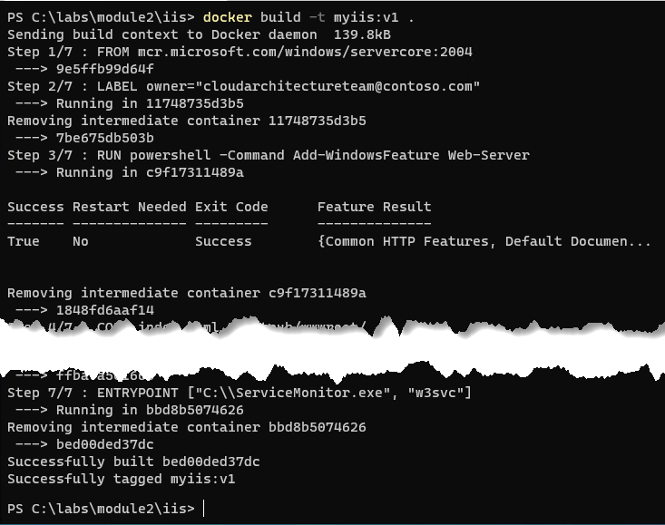

1. Run a new container based on **myiis:v1** image by using the command
    ```powershell
    docker run -d -p 8099:80 myiis:v1
    ```
   
   Output:
    ```
    PS C:\labs\module2\iis> docker run -d -p 8099:80 myiis:v1
    55e05db5dac188c3c740bdf43a86fccdeddaa1f159e7258702417f1dcedbad55
    PS C:\labs\module2\iis>
    ```
1. The full container ID is shown after the run command (**55e** in the above screenshot), or can be obtained by using ```docker ps```


7. Open any web browser of your choice and browse to the IP address from the previous step.  
   
   ```
   start http://localhost:8099
   ```

    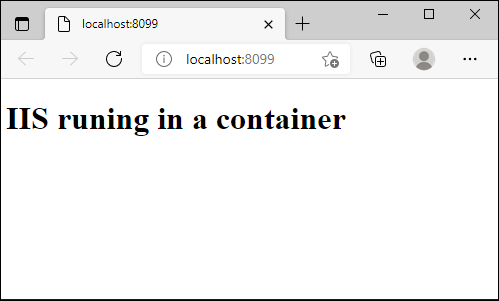  
   

### Summary

This concludes the exercise on creating a new image with IIS server. If you are looking to leverage IIS server beyond this lab, then you
may want to use Microsoft official IIS server image (**mcr.microsoft.com/windows/servercore/iis**) which is available at (<https://hub.docker.com/r/microsoft/iis/)>. The underlying process is pretty much same but the main benefit of using the official IIS image is that Microsoft releases updated images on a regular basis including patches and fixes.

---

## Exercise 3: Building an ASP.NET Core application

In the previous task, you built container images using some of the more mature technologies and products released by Microsoft. In this task,
you will build container that will run ASP.NET Core Web Application. If you completed the Module 1 lab, this will be very similar. However, we will now build the ASP.Net Core application on Windows instead of Linux. Furthermore, we will use the multi-stage build process rather than building the application manually with **dotnet** CLI.  

ASP.NET Core is a significant step forward for Microsoft to allow ASP.NET to run across platforms including MacOS, Linux and Windows.
ASP.NET sits on top of .NET Core, so it also offers cross-platform support. 

> Note: To understand when to use .NET Core and when to use .NET Framework please read article: <https://docs.microsoft.com/en-us/dotnet/articles/standard/choosing-core-framework-server>  

In this exercise, you will package a simple ASP.NET Core MVC application into a container image using a Dockerfile. Finally, you will run container hosting the ASP.NET Core application using the **docker run** command.    

### Building and Running ASP.NET Core 3.x Application Inside Container

1. Change to the relevant directory using the following command: 
    ```powershell
    cd labs\module2\aspnetcore
   ```

2. You are provided with a Dockerfile. View the content of the Dockerfile by running the command 

    ```powershell
    code Dockerfile
    ```
    
    The Dockerfile should look like the one below (note this is a multi-stage Dockerfile). 
   
   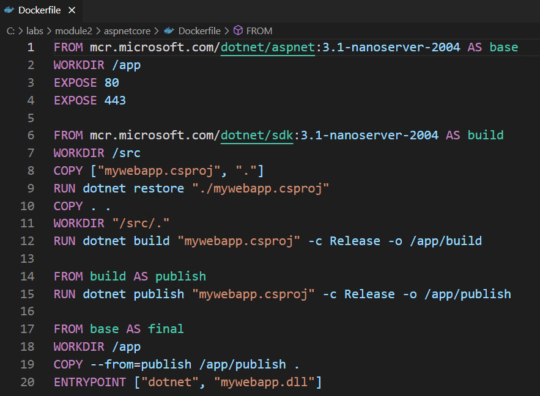

3. To create the container image run the command 

    ```powershell
    docker build -t aspnetcoreapp:3.1 .
    ``` 
   
   > Notice the use of tag **3.1** that signifies the dotnet core 3.1 framework version

4. Launch the container running the app inside it by running the command        
    
    ```powershell
    docker run -d -p 9000:80 aspnetcoreapp:3.1
    ``` 
   
5. You are now running ASP.NET Core application inside the container listening on the port 80 which is mapped to port 9000 on the host.

6. To see the ASP.NET Core web application in action open the web browser and navigate to **localhost** port **9000** 

    ```powershell
    start http://localhost:9000
    ```
   
    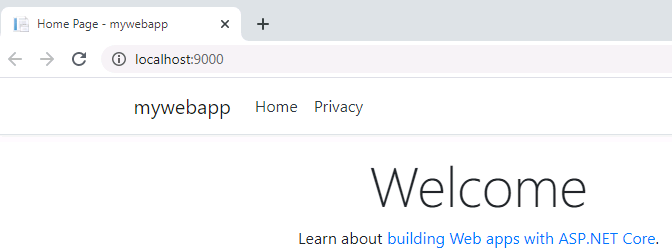

7. Run the following command to stop and remove all containers: 

    ```powershell
    docker stop (docker ps -aq) ; docker rm (docker ps -aq)
    ```

### Congratulations!

You have successfully completed this lab.

