# Module 3: Table of Contents

> Duration: 60 minutes     

[Exercise 1: Working with Data Volumes](#exercise-1-working-with-data-volumes)  

[Exercise 2: Working with Docker-Compose](#exercise-2-working-with-docker-compose)  

[Exercise 3: Running Containers with Memory and CPU Constraints](#exercise-3-running-containers-with-memory-and-cpu-constraints)  

## Exercise 1: Working With Data Volumes

In this exercise, you will learn how to mount a host directory as a data volume. The host directory will be available inside the container along with all the files (and sub directories). Later you will update a file on the host shared through a data volume from within the container. Remember that by default, data volumes at the time of mounting are read/write (unless you choose to only enable them for read only access).  
  
Docker containers, by design, are volatile when it comes to data persistence. This means that if you remove a container, for example, using docker "rm command, all the data that was in the container (running or stopped) with be lost. This certainly causes a challenge for applications that are running in the container and need to manage state. A good example here would be a SQL Server Database file from a previous lab that is required to be persisted beyond the life of the container running the SQL engine. The solution to this problem is to use data volumes. Data volumes are designed to persist data, independent of the container's lifecycle.  
  
Volumes are initialized when a container is created. Some of the key characteristics of volumes are listed below:   
  
  - Data volumes can be shared and reused among containers.  
  
  - Changes to a data volume are made directly by the container or the host.   
  
  - Data volumes persist even if the container itself is deleted.  

>Docker never automatically deletes volumes when you remove a container nor will it "garbage collect" volumes that are no longer referenced by a container. This means you are responsible for cleaning up volumes yourself.

### Mount a host directory as a data volume

1. You will need to run the commands in this section using the PowerShell console as an administrator. Right click the **PowerShell** icon on the taskbar and select **Run as Administrator**.

    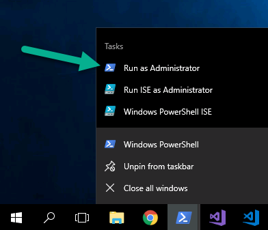

1. Navigate to your C:\\ drive: 

    ```
    cd C:\
    ```
 
1. Create a directory on the host operating system and then add a plain text file to it. Create a new directory on the C drive by running the command 
    ```
    mkdir MyData
    ```

    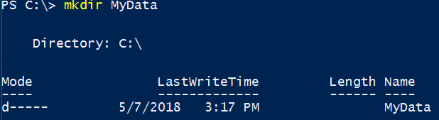

1.  Display the contents of the folder you just created in previous step by running the command ```ls MyData```. It is currently empty.  

1. You are now ready to run a container in the interactive mode and mount the host directory as a data volume. Run the command 

    ```powershell
    docker run -it -v C:/MyData/:C:/Data/ mcr.microsoft.com/windows/nanoserver:2004
    ```

    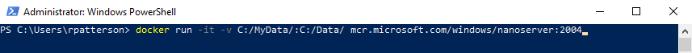

    >Notice the **-v** switch that is required to mount the host directory **C:\MyData** inside the container as **C:\Data**. This will result in container access to contents of **C:\MyData** on the host inside the container as **C:\Data**. You can choose same name for the directory inside the container and host but it's not mandatory as you see in the above command (**C:\MyData** on the host and **C:\Data** inside the container)

1. On the container PowerShell Console first check the hostname by running the command ```hostname```

    >The actual hostname for your container may be different than pictured below. Most importantly though, the container hostname will be different from you VM hostname.

    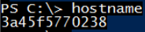

1. List the directories by running the command ```dir``` 
    >Notice the **data** directory as part of the listing.

    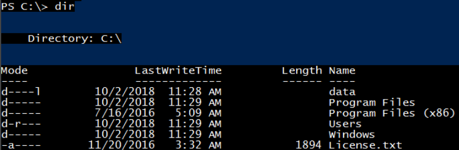

1. Create a file in the folder and add more text to it. Run the command: 

    ```powershell
    echo File is updated by container: %COMPUTERNAME% >> c:\data\file.txt
    ```
    
    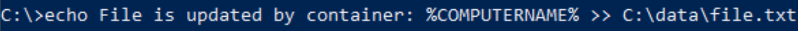

    > **%COMPUTERNAME%** is equivalent to **hostname** 

1. You can access and update the content of the data directory. First, run the command 

    ```powershell
    dir c:\data
    ```
    
    >This will list the content structure residing inside the data directory. 

    >Notice **file.txt** is present inside the data directory. This is the same file you created earlier on the host.

    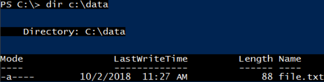

1. Look at content inside the **file.txt** by running the command 

    ```powershell
    type c:\data\file.txt
    ```

    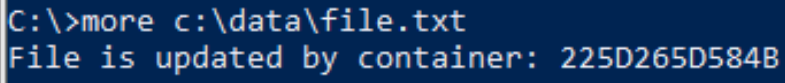

1. You can now exit the container and return to host by running the command `exit`

    

1. On the host PowerShell Console run the command 

    ```powershell
    type C:\MyData\file.txt
    ```
   
    >**Notice** that changes made from the container persist on the host by the **file.txt**.

    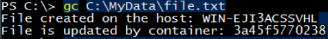

1. Run `docker ps -a` to get the ID of stopped containers, and then record the container ID 

    >To gather more information about container and volumes that has been mounted you can run the command `docker inspect <<container id>>`.

    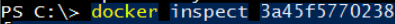

1. The docker inspect command outputs a rather large JSON file on the display. You may need to scroll down to find the section labeled "Mounts". 
    
    >Notice that **c:\\mydata** is the source and **c:\\data** is the destination. Also, RW refers to Read/Write.

    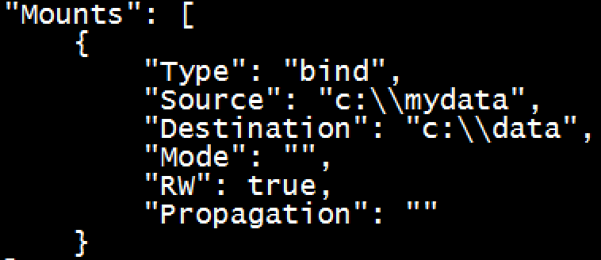

1. Let's run another container in interactive mode and mount the host directory as a data volume. Run the command 

    ```powershell
    docker run -it -v C:/MyData/:C:/Data/ mcr.microsoft.com/windows/nanoserver:2004
    ``` 
 
    

1. Look at content inside the **file.txt** by running the command 

    ```powershell
    type c:\data\file.txt
    ```    

    

1. Add more text to it. Run the command: 

    ```powershell
    echo File is updated by container: %COMPUTERNAME% >> c:\data\file.txt
    ```

1. On the host machine, go to **C:\MyData** from the file explorer and open **file.txt**  

    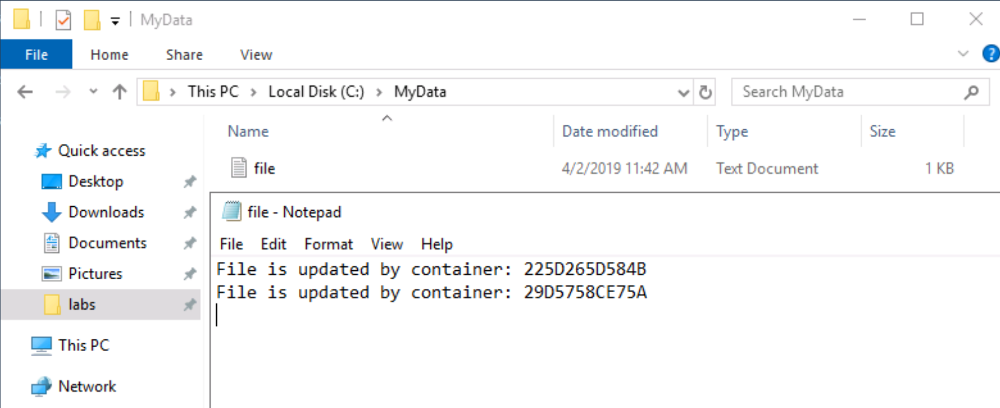
    
1. Update the content of the file with notepad and save it.  

    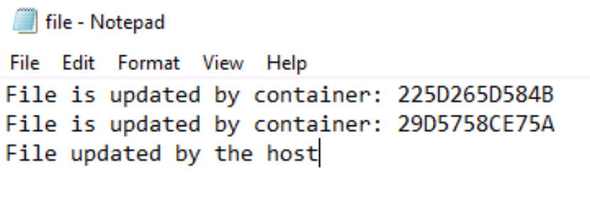

    >The two different **hostnames** correspond to the two Ids of the containers that wrote in the file.     

1. Go back to the Powershell windows and check that the container can see the host changes with the command 

    ```powershell
    more c:\data\file.txt
    ```
    
    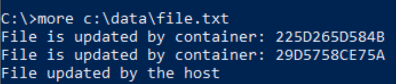

    >Because of concurrency challenges, you would probably not have multiple containers and hosts writing to the same file. The purpose of this exercise was only to show how we can persistent data across containers beyond their short lifecycle.  

1. Finally, you can run `exit` to stop the running containers  


### Mount a shared-storage volume as a data volume

In the previous section you learn how to mount a directory on the host as a data volume. That's a very handy way to share the content from host to container but it's not ideal in terms of portability. Basically, if you later run the container on a different host there is no guarantee that host will have the same directory. This would cause the app inside the container to break as it depends on a share that is not implemented by the host. In cases like these when a higher level of portability is desired, you can mount a *shared storage volume*. Docker has some volume plugins that allow you to provision and mount shared storage, such as iSCSI, NFS, or FC. A benefit of using shared volumes is that they are host-independent. This means that a volume can be made available on any host on which a container is started as long as the container has access to the shared storage backend, and has the plugin installed.

In this exercise, you will learn how to create and use a shared-storage volume. To keep the lab accessible and easy to follow, you will use the *local* driver which uses local host for the storage. However, the exact same concepts will work against production ready storage drivers like Convoy and others. For more information on the Convoy volume plugin, please visit: [https://github.com/rancher/convoy](https://github.com/rancher/convoy)


1.  First, let's create a volume by running the command following command from a Powershell window 

    ```powershell
    docker volume create -d local myvolume
    ```

      

1. You can list all the volumes by running the command `docker volume ls`. Notice that **myvolume** is available as a local driver.  
    
    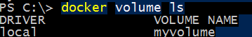

1. You can use **docker inspect** command with the volumes too. Run the command `docker inspect myvolume`

    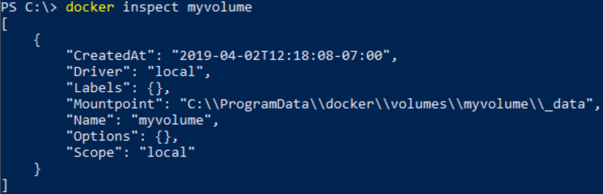
  
    >**Mountpoint** is set at a location on the **C** drive under the **ProgramData\docker** folder. This is the default location for local storage drivers. If you use another commercial storage driver,
the location may be different. 

1. To launch a container and make that storage volume available inside the container run the command 

    ```powershell
    docker run -it -v myvolume:C:/Data/ mcr.microsoft.com/windows/servercore:2004 powershell
    ```
    
    This command is like the command from last section where you shared the host directory, except that within the **-v** switch you are using the name of the storage volume rather than the path to the host directory. 

1. On the PowerShell command prompt inside the container, run the command `dir` to list the directories available in the container.  
 
    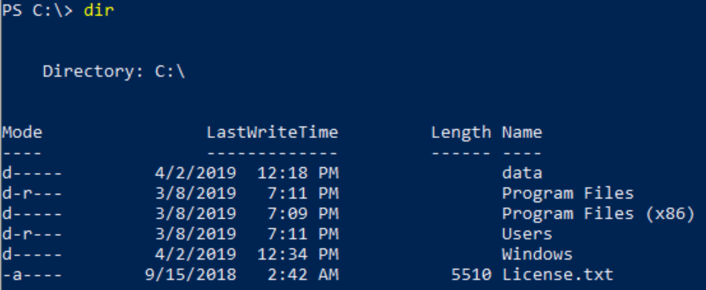

1. Notice the data directory. You can now add/remove files to it. Let's create a new text file and add text content to it. On the command prompt run the command 

    ```powershell
    "File created on the host: $(hostname)" >> c:\data\sample.txt
    ```

    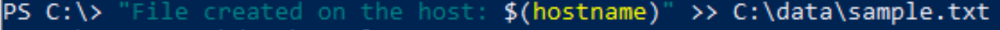 

1. Confirm that file sample.txt has been created successfully by running the command 
    ```powershell
    more c:\data\sample.txt
    ```  
 
    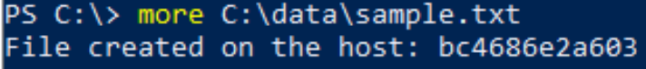  

1. Now exit the container by running the command `exit`. This will take you back to PowerShell console on the host.  

1. To check the content of sample.txt file from the host run the command 

    ```powershell
    gc C:\\ProgramData\\docker\\volumes\\myvolume\\\_data\sample.txt
    ```  

    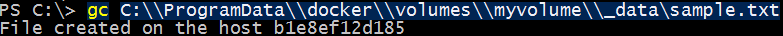    

---

## Exercise 2: Working with Docker-Compose

### Challenges with Multi-Container Applications

When working with multi-containers applications, you will need to make sure that applications can discover each other in a seamless fashion. Consider a quite common scenario where a web application (that acts as a front-end) calls to a backend RESTful web API to fetch content. In this scenario, the web app would need to access the web API in a consistent fashion. In addition, due to the fact the web application has a dependency on the web API, that dependency must be expressed when launching the applications in containers. It is imperative that we are able to launch and test a multi-container application the same way across development, test and production environments.

Docker has provided a tool called **"docker-compose"** that enables you to describe your applications as services within a YAML file, docker-compose.yml. A service in this context really means, "a container in production". A service only runs one image, but it codifies the way that image runs - what ports it should use, how many replicas of the container image should run (so that the service has the capacity it needs), and so on. Scaling a service increases the number of container instances running the application image, assigning more computing resources to that service in the process.

### Working with Docker-Compose

In this exercise, you will work with a simple "Famous Quotes" application that is composed of a frontend web app that talks to a RESTful API to fetch quotes in JSON format. Both the web app and API are developed using ASP.NET Core and each will run in a separate container. As this is a multi-container scenario, you will use a docker-compose file to:

- Ensure the web API can be accessed by the web app without the need to hardcode its FDQN or IP Address. Instead of hardcoding the IP Address (or FDQN) you can use a docker-compose.yml file to make these services discoverable

    >Note: Recall from the previous lab where a web application needed to access SQL Server running in a separate container. In that situation, we provided the web application the IP Address of the container running SQL Server in the web.config configuration file.  

- Express specific dependencies, such as the web app container **depends on** the web API container

- Get both application components up and running in separate containers with a single command (i.e., without using individual docker-run commands for each container).


1. Launch the **PowerShell Console** (if not already running) and change your current directory to "**compose**" folder by running the command 

    ```powershell
    cd C:\labs\module3\compose
    ```

    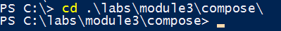

1. Before proceeding further let's stop all the running containers from previous task. Run the command 

    ```powershell
    docker stop (docker ps -aq)
    ```

    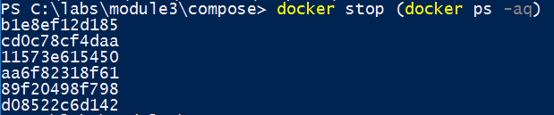

1. First, look at directory structure by running the command `dir`.

    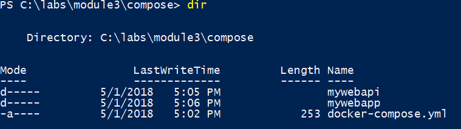

1. Notice that you have two folders "**mywebapi**" and "**mywebapp**" representing the web API and web application, respectively. First, you will inspect the piece of code that is making the RESTful call to mywebapi. To do that run the command: 

    ```powershell
    gc .\mywebapp\Controllers\HomeController.cs
    ```

    

1. This displays the code within HomeController.cs file. You may need to scroll down to view the code that calls the mywebapi RESTful endpoint. The actual URI is [http://demowebapi:9000/api/quotes](http://demowebapi:9000/api/quotes). 

    >Notice the use of **demowebapi** which is not a FQDN nor IP Address, but rather a service that is defined within the **docker-compose.yml** file (which we will review next). By using the service name, the web application can simply refer to the Web API app (using that same name) across all environments, including development, test and production etc.

    

1. Let's inspect the **docker-compose.yml** file. Run the command

    ```powershell
    gc .\docker-compose.yml
    ```

    

    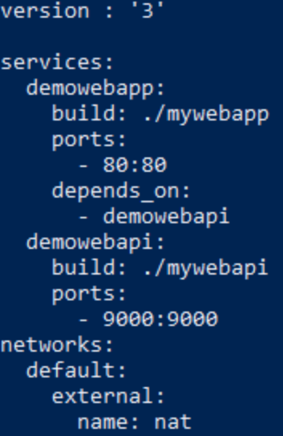

    >Knowledge: First, notice the structure of the file. All .YML files follow the YAML structure (more information about the extension can be found at <https://www.reviversoft.com/file-extensions/yml>. For docker compose usage you first define the version number and then specify the structure of your services. In this case, we have two services, namely "*demowebapp*" and "*demowebapi*". The demowebapp service declaration starts with the build instruction and points to folder "*mywebapp*" that contains the ASP.NET core application and relevant Dockerfile (recall the file entitled, DockerFile, that resides in the root of the application). Note how the compose file contains sections, or "instructions": Services, networks, etc. The build instruction is equal to the *docker build* command. Then ports are mapped from the host's port 80 to the container's port 80.The *depends\_on* directs the docker-compose to launch the *demowebapi* container first since *demowebapp* depends on it. Also, the discoverability is done by using the service names (as mentioned in the paragraph above whereas, *demowebapp* can access *demowebapi* by its service name, rather than FDQN or IP Address).
    >
    >Next is the *demowebapi* service declaration. It also starts with the build command pointing to the "mywebapi" folder that contains the Dockerfile and relevant ASP.NET Core files. Ports are mapped from host port 9000 to container port 9000.
    >
    >Finally, the networks section keeps the default settings to nat networking. This network declaration is needed for windows containers now. Basically, it tells docker compose to use default nat networking.

### Docker Compose Up

1. Docker Desktop installed the docker-compose.exe file for you onto the VM, if you would like to see it, you can see the URL here: **https://github.com/docker/compose/releases/download/1.12.0/docker-compose-Windows-x86\_64.exe**  

1. At this point, you are all set to run the multi-container application with a single command 

    ```powershell
    docker-compose.exe up -d
    ```

    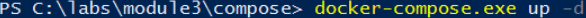

    >Knowledge:  The docker-compose.exe tries to make it simple to start and stop the services (running containers) with commands like up and down. The **-d** switch works the same as when used with the docker build command, which instructs docker to run the container in the background rather than interactively. If you don't provide any switch parameter, the default is set to interactive.

    >Note:  As the command executes, you will notice that the "mywebapi" container is built first. This is because we mention in the yml file that "mywebapp" depends on it, so it will build first. Also, if the image for "mywebapi" already exists, then it won't be built again.

    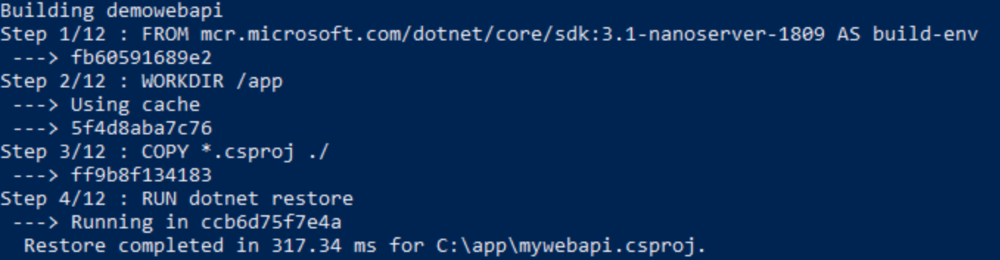

    Next, Docker will build the container image for "mywebapp."

    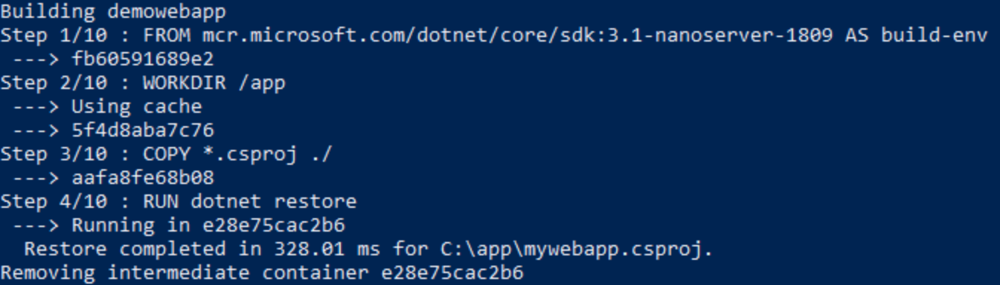

    >Note:You can safely ignore any warnings.

1. Finally, docker-compose will run both containers using the instructions from the docker-compose.yml file.

    

1. You can check details about running docker cmpose services by executing the command `docker-compose ps`

    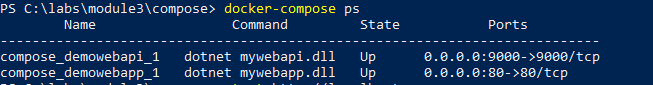

1. Open web browser of your choice and browse to localhost 

    ```powershell
    start http://localhost
    ```
    You should land on the home page of web application as shown below.

    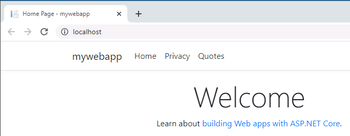

    >To test the Web API you will can select the **Quotes** option from the top menu bar. This will result in a call to web API and results being displayed on the web application.

    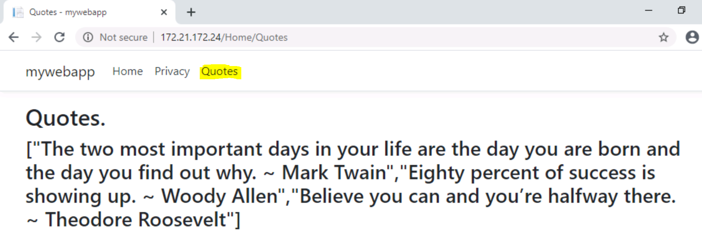

### Docker Compose Down

When you wish to stop and remove the multi-container application that was launched by docker compose, you will use docker-compose down command. The down command safely stops and removes all the containers that were launched by the up command earlier using the docker-compose.yml file.

>**Knowledge**: If you only wish to stop the multi-container applications and associated running containers use "**docker-compose stop**" command instead. This command will stop the containers, but won't remove them.

1. On the PowerShell console run the command 

    ```powershell
    docker-compose down
    ```

    First the containers are stopped and then they are removed. Finally, the docker compose network may be deleted.

    ```
    PS C:\labs\module3\compose> docker-compose down
    Stopping compose_demowebapp_1 ... done
    Stopping compose_demowebapi_1 ... done
    Removing compose_demowebapp_1 ... done
    Removing compose_demowebapi_1 ... done
    Network nat is external, skipping
    PS C:\labs\module3\compose>
    ```


---

## Exercise 3: Running containers with memory and CPU constraints

By default, when a container is run, it has no resource constraints. Without constraints, a container can use as much of a given resource as the host's kernel scheduler will allow. Docker enables you to control how much memory, CPU, and/or block IO a container can consume by setting runtime configuration flags. In this exercise, you will run a container with resource constraints. To follow best practices, you should always establish resource constraints on your containers.

### Run a container with memory constraints  

In this task, you will launch a container with a pre-defined memory limit, to ensure the container does not consume the host's memory beyond the memory limit. Later, you will test the container memory limit by simulating higher memory consumption inside the container.


1. Before running the container open two new **PowerShell** Consoles
    >You will use one of these consoles to run the docker container and interact with it. The other console will be leveraged to monitor the memory usage of the container.

1. Use one of the open **PowerShell** consoles to launch a new container with a memory limit of 500 megabytes (MB) by running the command 

    >IMPORTANT: If your lab files for module 3 are not located in the directory **C:/labs/module3/** then change the **source** (source=C:/labs/module3/tools/) directory in the comand below 


    ```powershell
    docker run -it -m 500M --mount 'type=bind,source=C:/labs/module3/tools/,target=C:/tools/' mcr.microsoft.com/windows/servercore:2004 powershell
    ```

    >Notice the use of -m (or --memory) switch within the run command. The switch specifies the maximum amount of memory the container can use. In this case, you are setting it to 500 M (where M = Megabytes). Other valid options are B = Bytes, K= Kilobytes and G = Gigabytes. These are also not case sensitive).

    >The use of -m switch is not related to memory but rather to bind mounting the tools folder on from the host into the container. This folder containes a Sysinternals tool "[TestLimit64.exe](https://live.sysinternals.com/WindowsInternals/)" which you will be using next to test the container memory limit.

1. To test the memory limit of container you will use the **testlimit** tool. Run the following command 

    ```powershell
    C:\tools\testlimit64.exe -d -c 1024
    ```

    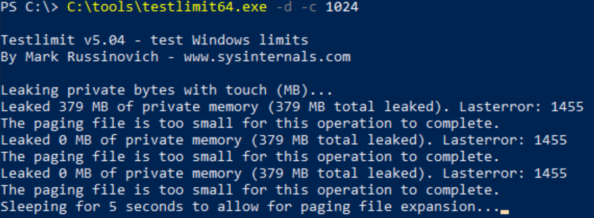

    >The **TestLimit64** tool will attempt to push the memory consumption of the container to 1024 MB (1 GB). However,because the container can't go beyond 500 MB, the value of memory consumed will always be under 500 MB (the exact value of how much memory is used will vary but won't go beyond the maximum available memory on container which is 500 MB)

1. Go back to the **PowerShell** console on the host (this is the second console that you opened earlier). Run the docker stats command 

    ```powershell
    docker stats
    ```

    >**Note**: This command gives you a live stream of various vital stats including memory, CPU, etc. directly from the container.

1. Notice the value under the column "**PRIV WORKING SET**". This represents the memory usage by the container; this is the value that docker has constrained to 500 MB.

    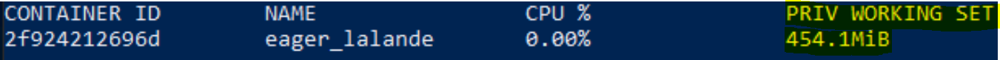

1. Now, you will reclaim the memory occupied by the running tool. Go back to the **PowerShell** console that was used to run the container and press the key combination "**Ctrl+C**". 
   
1. Go back on the **PowerShell** console on the host that is displaying the vital stats for the container. 
    >Note:Notice that memory usage has dropped significantly.

    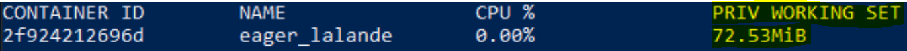

1. Hit "**Ctrl+C**" to stop the docker stats command

1. In the other **Powershell** window, type `exit` to exit the running container


### Run a container with a CPU usage limit

In addition to setting a memory constaint, you can also constrain the CPU usage by the container. By default,Docker does not apply any constraint on container CPU usage, which essentially means the container is free to utilize host CPU up to 100%. In this task, you will put a limit on CPU utilization by the container.

1. Since modern machines have CPUs with multiple cores you will first determine the number of cores available to the host virtual machine by running the command 

    ```powershell 
    Get-WmiObject –class Win32_processor | Select -ExpandProperty NumberOfCores
    ```

    >Take note of the number of cores available. In this case there are 2 cores, but the value you see may differ.
    
    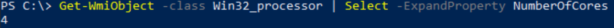

1. You will now launch a new container and limit its host CPU utilization to ~25%. Make sure that you set half of the availble CPU here. If your machine just has 2 cores, set the value to 0.5 

    >**IMPORTANT**: If your lab files for module 3 are not located in the directory **C:/labs/module3/** then change the **source** (source=C:/labs/module3/tools/) directory in the comand below 

    ```powersehll 
    docker run -it --cpus .5 --mount 'type=bind,source=C:/labs/module3/tools/,target=C:/tools/' mcr.microsoft.com/windows/servercore:2004 powershell
    ```

    >**Note**:  Notice the use of --cpus switch which will specify how much of the available CPU resources the container can use. For example, the host machine has two CPUs and if you set --cpus to 1.0, the container will be able to access, **at most**, one of the CPUs on the host.


1. Go back to the **PowerShell** console on the host (this is the second console that you opened earlier). Run the docker stats command 

    ```powershell
    docker stats 
    ```

    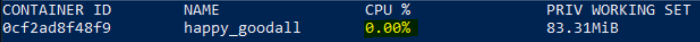

1. Go back to the **PowerShell** console in the container and make sure that you are authorized to run PS1 scripts by running the following command 

    ```powershell
    Set-ExecutionPolicy -Scope Process -ExecutionPolicy Bypass
    ```

1. You will now test the CPU constraint of ~25% by stress testing the CPU utilization on the container. Switch back to the **PowerShell** console that you used earlier to launch the container with a CPU usage limit. Execute the command 

    ```powershell
    C:\tools\cpu-stress.ps1
    ```

    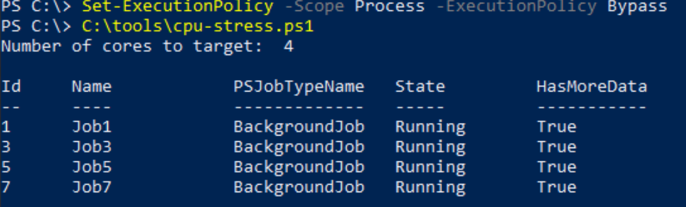

    >**Note**:   This command executes the script on the container which stress tests CPU, targeting all cores available to the container. However, because you set a constraint on CPU utilization, the container will never able to consume more than .5 CPU (or the value you changed it too).To validate the CPU usage, go back to PowerShell console displaying **docker stats**. Notice the container CPU utilization is ~25% and not 100%. The CPU utilization may be slightly lower or higher than 25%, so it may not be exact. 

    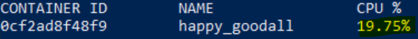

### Congratulations!

You have successfully completed this lab. 

