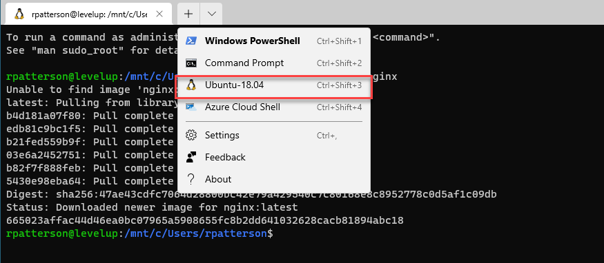
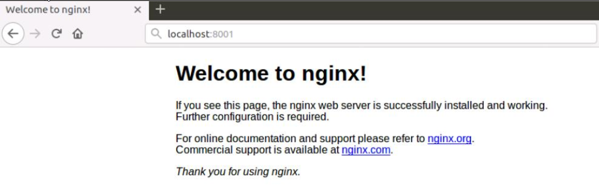
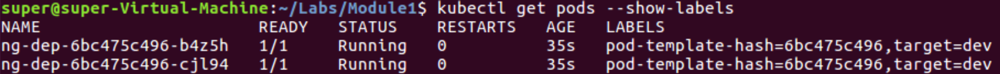
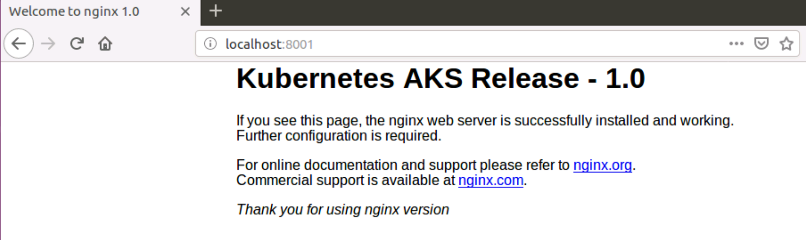
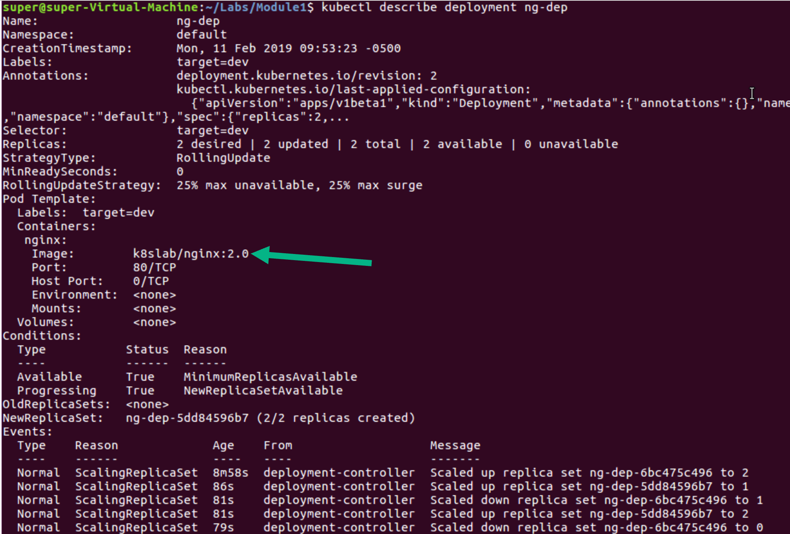
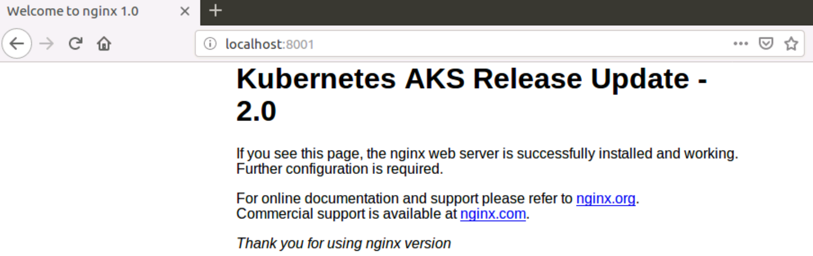
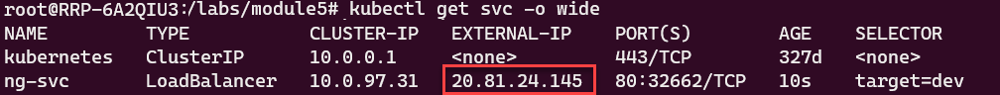
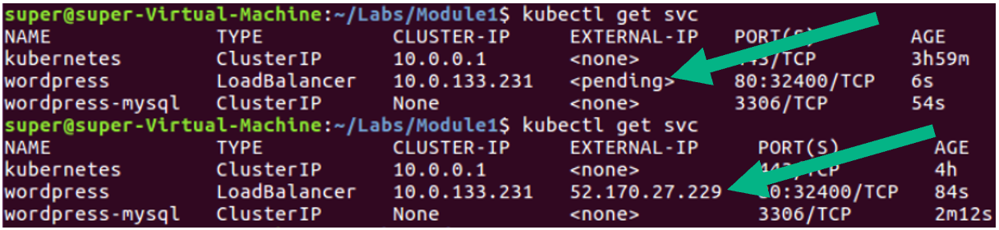
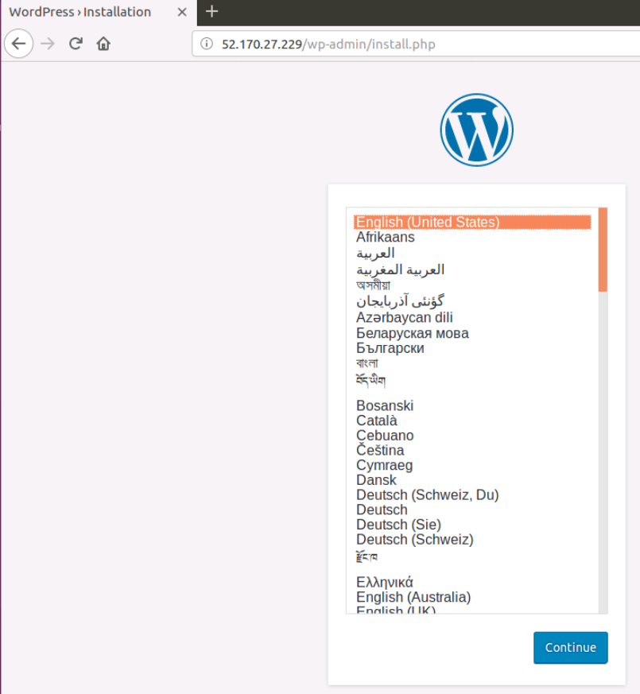

# Lab: Module 5 - Kubernetes Core Concepts  

>Duration: 60 minutes  

# Table of Contents

[Exercise: Create Azure Kubernetes Service (AKS) Cluster](#exercise-create-azure-kubernetes-service-aks-cluster)  

[Exercise: Creating a Pod Declaratively](#exercise-creating-a-pod-declaratively)  

[Exercise: Creating and Filtering Pods with Labels](#exercise-creating-and-filtering-pods-with-labels)   

[Exercise: Adding/Updating/Deleting Labels on a Pod](#exercise-addingupdatingdeleting-labels-on-a-pod)  

[Exercise: Working with ReplicaSets](#exercise-working-with-replicasets)  

[Exercise: Working with Deployments](#exercise-working-with-deployments)  

[Exercise: Working with Services](#exercise-working-with-services)  

[Exercise: Working with Persistent Volumes Claims & Secrets](#exercise-working-with-persistent-volumes-claims-secrets)  

### Prerequisites 

* WSL 2 Ubuntu 18.04 
* Windows Terminal
* Visual Studio Code 
* Docker Desktop for Windows
* Azure CLI   
    ```powershell
    curl -sL https://aka.ms/InstallAzureCLIDeb | sudo bash
    ```

>Use [this](https://docs.microsoft.com/en-us/windows/wsl/tutorials/wsl-containers) tutorial for installation and setup instructions
 
### Objectives

Lab provide walkthroughs on various Kubernetes topics:  

  - Creating an AKS cluster  

  - Creating, deploying, and deleting Pods  

  - Deployments, Services, Volumes and Secrets  

  - Working with Labels and Annotations  


## Exercise: Create Azure Kubernetes Service (AKS) Cluster  

Open a Linux terminal by launching  **Windows Terminal** and choosing **Ubuntu 18.04**.




In this exercise you will create an AKS cluster.  

### Tasks  

**1.  Connecting to your Azure Subrciption with az CLI**  

Login to Azure with the command that will open a Firefox to allow
you to connect with your Microsoft account. Once connected, you can
close Firefox and go back to the command prompt.  
  ```powershell
  az login
  ```  

The command line will automatically open your browser to login. Once
you are logged in using your Microsoft account associated with Azure
subscription, close the browser and go back to command line.  

Once logged in, you should see a list of subscriptions once you are
logged in. You can also run the following command to see the list of
subscriptions in the table format.  
  ```powershell
  az account list -o table
  ```  

Set the correct subscription, put the name of the subscription in
quotes.  
  ```powershell
  az account set --subscription "<subscription_name>"
  ```  

**2.  Creating the AKS cluster**  

Run the following command to deploy Kubernetes cluster with AKS
(replace **INITIALS** with your initials).  
  ```powershell
  rg="aks-cluster-$RANDOM"
  az group create -n $rg -l eastus
  ```
  Output
  ```
  {
    "id": "/subscriptions/457d9a90-...-720313db4b73/resourceGroups/aks-cluster-5105",
    "location": "eastus",
    "managedBy": null,
    "name": "aks-cluster-5105",
    "properties": {
      "provisioningState": "Succeeded"
    },
    "tags": null,
    "type": "Microsoft.Resources/resourceGroups"
  }
  ```

  Create the Kubernetes Cluster
  
  ```powershell
    az aks create --resource-group $rg --name aks-k8s-cluster --node-count 2 --node-vm-size "Standard_DS2_v2" --generate-ssh-keys --vm-set-type VirtualMachineScaleSets --disable-rbac
  ```   

>**NOTE**:  It will take approximately 10 minutes for the cluster to provision
successfully in the US. 

If needed, install `kubectl` locally 
```bash
az aks install-cli
```


Run the following command to download the AKS Kubernetes cluster configuration to the local config file: **~/.kube/config**  

  ```powershell
  az aks get-credentials --resource-group $rg --name aks-k8s-cluster
  ```  

## Exercise: Creating a Pod Declaratively  

This Exercise shows the use of YAML file to create a pod declaratively.  

### Tasks  

**1.  Create a Pod declaratively**  

To create a Pod, you will use the YAML file provided to you. You may
want to open the **simple-pod.yaml** file and understand its contents.
The pod definition contains the **Nginx** container to run at port 80
inside the Pod.  
  ```powershell
  kubectl apply -f simple-pod.yaml
  ```  

Now, make sure pod is up and running  
  ```powershell
  kubectl get pods
  ```  

You should see pod named **nginx-pod**   

**2.  Accessing Nginx container running inside the Pod**  

One of the easiest way to call a pod is to use a port forwarding technique. Run the port-forward command  
  ```powershell
  kubectl port-forward nginx-pod 8001:80
  ```  

Browse to the **Nginx** Website. Open the browser and navigate to **http://localhost:8001**  

You should see a page that looks like the following   
   

Once you are done, make sure to stop port forwarding by pressing 
**control-C** key combination. If your host machine is Windows, try **Windows-C**
key combination.  

**3.  Deleting a running Pod**  

You are now going to delete **nginx-pod**. It may take few seconds to
get deleted.  
  ```powershell
  kubectl delete pod nginx-pod
  ```  

The Exercise on creating pods declaratively has been completed.  

## Exercise: Creating and Filtering Pods with Labels  

In this Exercise you will create a pod that has labels associated with
it. Labels make it easy to filter the pods later. Labels play vital role
in Kubernetes ecosystem, so it's important to understand their usage
properly.  

Resources needed to complete this exercise are available inside module1
folder.  

## Tasks  

**1.  Create a Pod declaratively**  

The **simple-pod-with-labels.yaml** file contains a pod definition which
is identical to **sample-pod.yaml**, except that it has two labels
assigned to it.  

Run the command to create the pod  
  ```powershell
  kubectl apply -f simple-pod-with-labels.yaml
  ```  

Now, make sure pod is up and running  
  ```powershell
  kubectl get pods
  ```  

You should see pod named **nginx-pod-with-labels** running.  

**2.  Show all labels that assigned to a pod**  

When you run `kubectl get pods` command, it won't show labels
associated with the pods.  

To get labels related information using the command with
**--show-labels** switch    
  ```powershell
  kubectl get pods --show-labels
  ```  

If you want to get labels that are assigned to a pod, then use the
name of pod in the command  
  ```powershell
  kubectl get pods nginx-pod-with-labels --show-labels
  ```  

**3.  Filtering pods based on a label**  

Let's say you want to only list pods that have label named
**kind=web** associated with them. You can use **-l** switch to apply
filter based on labels.  
  ```powershell
  kubectl get pod -l kind=web
  ```  

To prove that it works as expected run the command again but change
the value of label **kind** to **db**. Notice, this time command won't
return any pods because we don't have any pod with label **kind** with
the value **db**.  
`kubectl get pod -l kind=db`  

## Exercise: Adding/Updating/Deleting Labels on a Pod  

In this Exercise you will create pod that has labels associated with it.
Labels make it easy to filter the pods later. Labels play vital role in
Kubernetes ecosystem, so it's important to understand their usage
properly.  

## Tasks  

**1.  Assigning new label to a running Pod**  

You can assign a new label (key=value) pair to a running pod. This
comes handy when you are troubleshooting an issue and would like to
distinguish between different pod(s). In this case, we will assign a
new label **health=fair** to the pod **nginx-pod-with-labels**, which is
already running.  
  ```powershell
  kubectl label pod nginx-pod-with-labels health=fair
  ```  

Now run the command to show the pod labels. Notice now, that an
additional label is added to the pod.  
  ```powershell
  kubectl get pods nginx-pod-with-labels --show-labels
  ```  

**2.  Updating value of an existing label that is assigned to a running pod**  

You can also update the value of an existing label that is assigned
to a running pod. Let's change the value of the label **kind=web** to
**kind=db** that is assigned to **nginx-pod-with-labels** pod.  
  ```powershell
  kubectl label pod nginx-pod-with-labels kind=db --overwrite
  ```  

**--overwrite** is needed because the pod is running and won't accept changes
otherwise.  

Now run the command to show the pod labels. Notice now, that kind has
changed from **web** to **db**.  
  ```powershell
  kubectl get pods nginx-pod-with-labels --show-labels
  ```  

**3.  Deleting label that is assigned to a running Pod**  

Let's delete a label **health** that we assigned earlier to the
**nginx-pod-with-labels** pod  
  ```powershell
  kubectl label pod nginx-pod-with-labels health-
  ```  

>Notice the minus (**-**) sign at the end of the command. You can also remove
a label from all running pods by using **--all** switch  
  ```powershell
  kubectl label pod health- --all
  ```  

Now run the command to show the pod labels. Notice now, that health is
not part of labels.  
  ```powershell
  kubectl get pods nginx-pod-with-labels --show-labels
  ```  

**4.  Deleting the Pod**  
To delete the Pod, run the following command:  
  ```powershell
  kubectl delete pod nginx-pod-with-labels
  ```  

## Exercise: Working with ReplicaSets  

In this Exercise, you will create a ReplicaSet, which will ensure that
there are always specified number of Pods running in the cluster. Label
selectors are used in the ReplicaSet as a criterion to match the pods.
Any time the total number of matching Pods falls below the specified
number defined in the ReplicaSet definition, the ReplicaSet controller
will make sure it brings the actual number of Pods to the specified
value.  

A ReplicaSet may create/delete Pods any time it sees the total number of
Pods fall below or above the specified value. In doing so, it may
terminate or create new Pods but it never relocates or migrates them.  

## Tasks  

**1.  Creating Pods through ReplicaSet**  

The **ng-rc.yaml** file contains a ReplicaSet definition that contains
Pod definitions, as well as a count for the number of Pods that need
to be running at any given point in time. You may want to open the
YAML file and notice the matchLabel field that contains **key=value**
for matching the Pods labels.  

Run the command to create a ReplicaSet.  
  ```powershell
  kubectl apply -f ng-rc.yaml
  ```  

Now, run the following command to see two new Pods created by the
ReplicaSet  
  ```powershell
  kubectl get pods --show-labels
  ```  

**2.  Testing the ReplicaSet Controller**  

With the Pods up and running, you will check if the ReplicaSet
controller is working as expected. You will do that by removing the
label (**target**) from one of Pods created by the ReplicaSet. This
should immediately make ReplicaSet spin up a new Pod since
**matchLabels** criteria demands a minimum two Pods with the label
(**target=dev**).  

First remove the label (you should have listing of Pods along with
their names from pervious step)  
  ```powershell
  kubectl label pod <POD-NAME> target-
  ```  

Now, run the following command to see one new Pod created by the
ReplicaSet, while an old Pod is still running.  
  ```powershell
  kubectl get pods --show-labels
  ```  

You can delete the additional Pod manually, but a better way to do
that is by assigning the (**target=dev**) label back to the Pod. This
will make the ReplicaSet terminate one of the Pods to ensure that
the total Pod count remains as two (and not three).  
  ```powershell
  kubectl label pod <POD-NAME> target=dev
  ```    

**3.  Deleting the ReplicaSet**  

To delete the ReplicaSet, run the following command:  
  ```powershell
  kubectl delete rs nginx-replica-set
  ```  

This will delete not only the ReplicaSet, but also all the Pods that
it was controlling by using the matching label criteria.  

**4.  Deleting the remaining Pod**

To delete the Pod, that we excluded from the ReplicaSet when we
removed the target label, run the following command:  
  ```powershell
  kubectl delete pod <POD-NAME>
  ```  

## Exercise: Working with Deployments

In this Exercise you will create a Deployment and roll out an
application update. Deployments provide a consistent mechanism for you to upgrade to a new version of applications while making sure there is no or very little downtime. Please note that internally, Deployments use ReplicaSets for managing Pods. However, you don't need to work directly with ReplicaSets, since Deployments abstract out that interaction.  

## Tasks  

**1.  Creating a new Deployment**  

The **ng-dep.yaml** file contains a Deployment definition. If you notice, this is nearly identical to the ReplicaSet definition that you used before. The Pod is going to create a nginx container with a tag **1.0**. The **1.0** represents the version number of this container and hence the application running inside it.   

Run this command to create a Deployment and associated ReplicaSet.  
  ```powershell
  kubectl apply -f ng-dep.yaml
  ```  

Now, run the following command to see new the Pods that are created.  
  ```powershell
  kubectl get pods --show-labels
  ```  

   
  
**2.  Accessing the 1.0 version of application**  

You will now browse to the nginx container by using the **port-forward**
command. First note down the pod name as displayed by the output
from the previous command. Just choose one of the pod's names, it's
not important which one you choose.  
  ```powershell
  kubectl port-forward <POD-NAME> 8001:80
  ```  

Open the browser and navigate to **http://localhost:8001**    
  
  
**3.  Updating the Deployment with 2.0 version**  

You are now going to update the deployment to run **2.0** version of
containers instead of **1.0**. This can be done in two ways. The
approach taken in this task is going to show you the imperative way of doing it, which is faster and will help you shorten your time during dev/test of your application. The alternate approach is what you have seen so far where you will use a YAML file.  

Make sure to stop the port forwarding before proceeding further. You can use **Windows-C** or **Command-C** key combination to terminate it.  

To start rolling out the new update, you will tell the deployment to change the container image tag from **1.0** to **2.0** by running the command:  
  ```powershell
  kubectl set image deployment ng-dep nginx=k8slab/nginx:2.0
  ```  

In the command above, **ng-dep** is the name of deployment and **nginx** is the name assigned to the container within the Pod template. Since the original version of the deployment was using **1.0** tag to pull down the container image, the above command will force the deployment to roll out a new deployment with image tagged as **2.0**  

Now, list all the pods and notice that old pods are terminating, and the new pods have been created.    
  ```powershell
  kubectl get pods
  ```  

Take a note of one of the newly created pods (the one created most recently).  

If you want to look at the deployment definition with the updated value of container image, run the following command:  

  ```powershell
  kubectl describe deployment ng-dep
  ``` 

  
>Notice the Image section (under Containers) with the value of container

>image being updated to **2.0**.

**4.  Accessing the 2.0 version of application**  

You will now browse to the **nginx** container by using the **port-forward** command. Replace the pod name by the one you noted in the last **get pods** command.    
  ```powershell
  kubectl port-forward <POD-NAME> 8001:80
  ```  

Open the browser and navigate to http://localhost:8001  

  

Make sure to stop the port forwarding before proceeding further. You can use **Windows-C** or **Command-C** key combination to terminate it.   

**4.  Deleting the deployment**   
Finally, remove the deployment with the following command  

  ```powershell
  kubectl delete deployment ng-dep
  ```   

## Exercise: Working with Services  

In this Exercise you will create a simple Service. Until now, you have been using the **port-forward** command to gain access to the Pods. Although, this works fine during dev/test, this approach does not really scale. Services help you expose Pods externally using label selectors.  

## Tasks  

**1.  Creating a new Service**  

The **ng-svc.yaml** file contains a Services definition. Services use label selectors to determine which Pod it needs to track and forward the traffic.  

Let's start by taking at a look at running Pods and their labels.  
  ```powershell
  kubectl get pods --show-labels
  ```  

Notice the label **target=dev** that is associated with the pods.  

Now, open the **ng-svc.yaml** file and examine the **selector** attribute that is followed by **target=dev**. This essentially means that this Service will track all Pods that have label **target=dev** and forward traffic to them.  

Run the following command to create the Service:  
  ```powershell
  kubectl apply -f ng-svc.yaml
  ```  

Now, check the of newly created service:  
  ```powershell
  kubectl get svc -o wide
  ```  
  

The above command will display the details of all available services along with the label selectors. You should see in the output, **ng-svc** with **PORTS 80:30101/TCP** and **SELECTOR target=dev**.  

**2.  Accessing the ng-svc Service**  

Open a browser and navigate to that **EXTERNAL-IP** address.  

**3.  Deleting Deployment and Service**  

You are now going to delete Pods that were created earlier by
deleting the Deployment. Also, you will delete the Service.  

To delete the Deployment run the command:  
  ```powershell
  kubectl delete deployment ng-dep
  ```  

To delete the Service run the command:  
  ```powershell
  kubectl delete service ng-svc
  ```  

## Exercise: Working with Persistent Volumes Claims & Secrets  

This Exercise shows the use of secrets to hide the password needed by WordPress to connect with MySQL. You will first create the secret declaratively using YAML file and then use it within the deployment files. Also, labels are used to ensure pods are tagged properly based on their usage. For example, WordPress pod is assigned **tier=frontend** value.    

## Tasks  

**1.  Create a secret declaratively**  

First you will create a new secret by using the **apply** command and passing the secret definition as an YAML file. You may want to open the YAML file in Visual Studio Code and look at the data value which is encoded in base64. This is required by Kubernetes.    
  ```powershell
  kubectl apply -f mysql-secret.yaml
  ```  

**2.  Deploy MySQL Pod (Single YAML file contains Deployment, Service and Volume Claims definitions)**  

  ```powershell
  kubectl apply -f mysql-pvc-dep-svc.yaml
  ```  

This may take few minutes. Run ```powershell kubectl get pods``` commands to make sure the pod is running before proceeding further.  

**3.  Deploy WordPress Pod (Single YAML file contains Deployment, Service and Volume Claims definitions)**   

  ```powershell
  kubectl apply -f wordpress-dep-svc-pvc.yaml
  ```  

Capture URL to access WordPress service.  

Run the following command until the external IP goes from pending to an IP address.  
  
  ```powershell
  kubectl get svc
  ```  

  

**4. Browse to the WordPress Website**  

Open a browser and navigate to `http://<external-ip>` you should see WordPress  

  

**5.  Deleting Deployments and Services**  

You are now going to delete Pods that were created earlier by
deleting the Deployments. Also, you will delete the Services.  

To delete the Deployment run the command:  
  ```powershell
  kubectl delete deployment wordpress  
  kubectl delete deployment wordpress-mysql  
  ```

To delete the Service run the command:  
  ```powershell
    kubectl delete svc wordpress
    kubectl delete svc wordpress-mysql
  ```

# Congratulations you have completed  Lab 5
